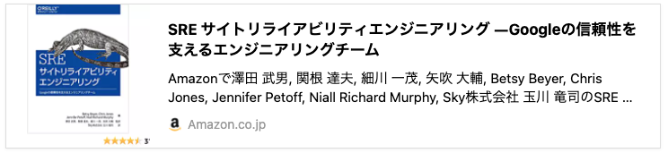

# Blog Embedded Link Generator (BELG)

- ogTagがないサイトへの対応
- go.modのmodule名

## 20210918
### 目的
- ペアプログラミング会がもくもく会に代わってよさげかテスト
- リモートでのペアプログラミングのやり方とか確認
- プログラミング学びたい

### 題材
Goで実装されたブログのリンク生成ツール。

### 題材の背景
マークダウンでブログやドキュメントを書くことがおおい。
埋め込みリンクをやりたいが、良いツールがない。

iframely  
一番使い勝手がいいが、iframeのため重い。Static Web向きではない。  
google adsenseのevent埋め込みなどができず、クリック数を集計できないなど問題あり。

### ツール概要
URLを与えると、そのサイトの情報を取得し、埋め込みリンクを生成する。
Static Webでの速さを重視し、プレーンなHTMLとして出力する。

必要な情報

- ページタイトル
- サイトの概要
- イメージ画像（あれば）
- サイトタイトル
- サイトのファビコン

こんなかんじ  


### ツール仕様
URLを引数に渡して実行するとHTMLの出力をする

```
$ belg https://xxxxxxxxx/aaaa/bbbb
<div class="belg-link">
  <div class="belg-left">
    
  </div>
  <div class="belg-right">
    <div class="belg-title">GitHub - ndabAP/vue-go-example: Vue.js and Go example project</div>
    <div class="belg-description">Vue.js and Go example project. Contribute to ndabAP/vue-go-example development by creating an account on GitHub.</div>
    <div class="belg-site-name">GitHub</div>
  </div>
</div>
```

### 現状と課題、タスク
現状はogtagが設定されていれば取り出せる状況。
しかし、サイトによってはogtagの設定がないものもあり、実質使い物にならない。

- ogtag以外の情報も取り出せるようにする
- amazonのような例外サイト
- ★その場合のデータ設計どうかんがえたらいいか？
- ★テストちゃんと書きたい
- 第2引数にイベント名を引き渡すことで、イベントを埋め込める

### og以外を取る場合、なにをとるか？
- ページタイトル
  - `<title>`をとる
- サイトの概要
  - `<meta name="description" content="" >`をとる
- イメージ画像（あれば）
  - なければサンプル画像をおく
- サイトタイトル
  - ドメインを表示
- サイトのファビコン
  - `<link rel="icon" href="/image/favicon.ico">`

おまけ
  - 画像ダウンロード？
  - amazon対応は余力あればそのあと
  - テストデータ生成